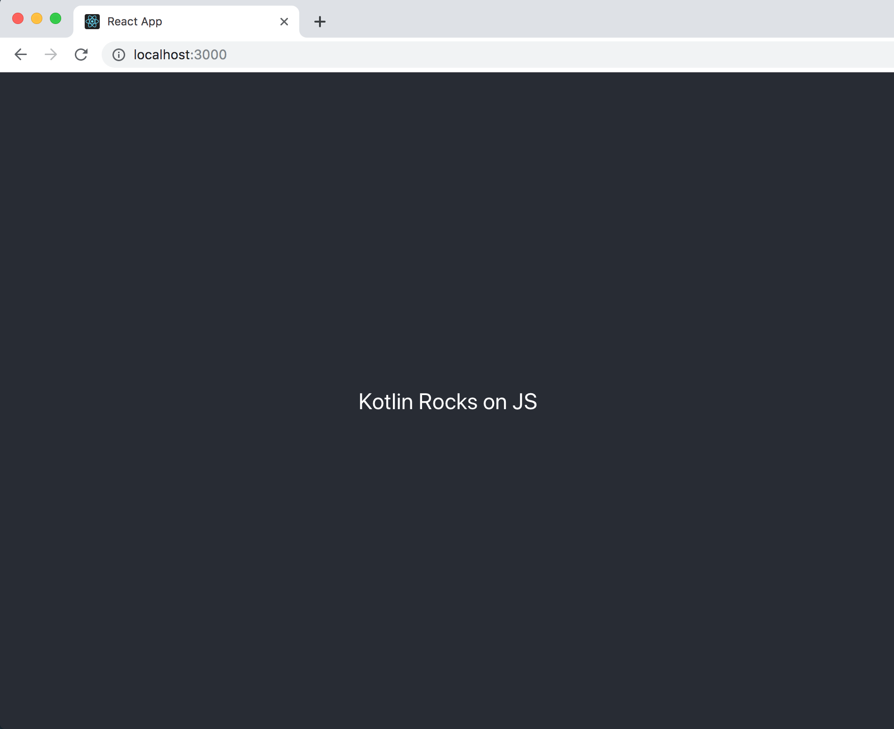

This is a project what I trying to practice how to Sharing code between iOS, Android and Web.

# Kotlin Multiplafrorm projects: Sharing code between iOS, Android and Web 

The core repository for the https://play.kotlinlang.org/hands-on/Targeting%20iOS%20and%20Android%20with%20Kotlin%20Multiplatform/01_Introduction tutorial

## Running

You need Xcode 10.3+ and Android Studio 3.4+ with Kotlin 1.3.41+ on macOS 10.14 to that tutorial project.

